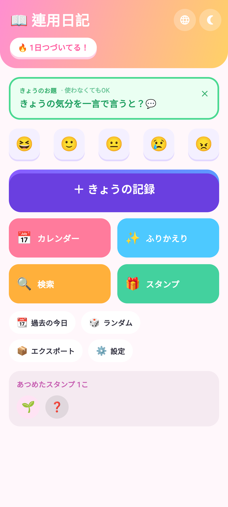
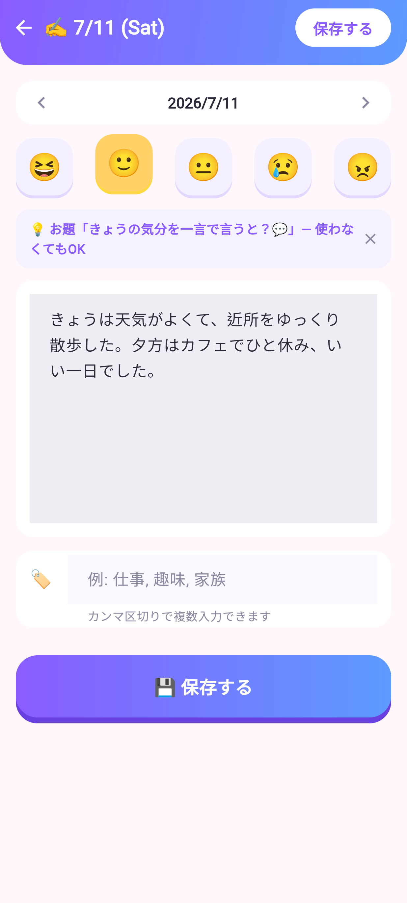
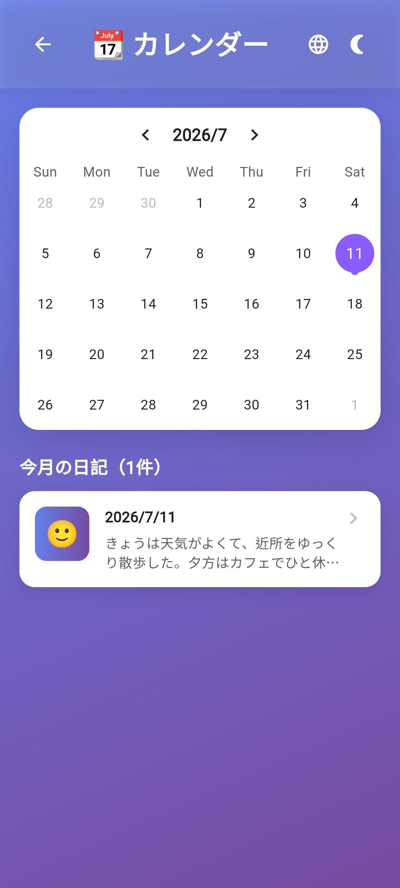

# Daily Diary - Flutter Mobile App

Cross-platform diary app built with Flutter, from concept to Google Play release.

(Flutter製クロスプラットフォーム日記アプリ - 企画からGoogle Playリリースまで)

A laid-back, playful diary you can jot in a snap.

(サッと書けて、ゆるっと続く。ポップな日記アプリ)

## Screenshots

  
  
  

## Features

| Feature | Description |
|---------|-------------|
| **10 Language Support** | 🇯🇵 Japanese, 🇺🇸 English, 🇨🇳 Chinese, 🇰🇷 Korean, 🇪🇸 Spanish, 🇧🇷 Portuguese, 🇮🇳 Hindi, 🇮🇩 Indonesian, 🇫🇷 French, 🇩🇪 German |
| **Dark Mode** | Full dark mode support with system preference detection |
| **Offline-First** | All data stored locally on device, no cloud dependency |
| **Calendar View** | Visual calendar with mood indicators and quick navigation |
| **Mood Stickers** | One-tap mood stickers on the home and writing screens |
| **Daily Prompt** | A light, optional prompt each day — dismiss it anytime, write however you like |
| **Save Celebration** | A little confetti and streak cheer when you save — keeps it fun |
| **Stamp Collection** | Collect reward stamps as you keep writing (entry-count & streak milestones) |
| **Onboarding** | Quick 3-page intro on first launch, re-viewable from settings |
| **Statistics** | Writing streaks, mood breakdown by sticker, and activity — playful, no scoring |
| **Year in Review** | A year of writing in one shareable card (entries, streak, top words) — diary text never included |
| **Search** | Full-text search and tag-based filtering (case-insensitive) |
| **Random Entry** | Rediscover past entries randomly |
| **App Lock** | Biometric / screen-lock protection; FLAG_SECURE blocks screenshots and task-switcher thumbnails |
| **Daily Reminder** | Configurable daily notification to keep the writing habit |
| **Data Backup** | Android Auto Backup + device-transfer enabled, JSON export/import, backup reminder banner |

## Tech Stack

| Category | Technologies |
|----------|--------------|
| **Framework** | Flutter 3.x, Dart |
| **State Management** | Provider |
| **Local Storage** | Hive (NoSQL) |
| **Monetization** | Google AdMob (non-personalized banner ads) |
| **Testing** | flutter_test unit tests + Android emulator integration test (E2E flow on CI) |
| **CI/CD** | GitHub Actions (analyze + test / cloud AAB build → auto-publish to Google Play / store-listing updates via Play Developer API) |
| **Localization** | Flutter intl (ARB files) |
| **Architecture** | Single-codebase cross-platform |

## Development Approach

This app was developed using **Claude Code** (AI-assisted development tool by Anthropic).

(このアプリは **Claude Code**（Anthropic社のAI支援開発ツール）を使用して開発しました)

### What Claude Code Helped With:
- UI/UX implementation with consistent design patterns
- Multi-language localization (10 languages, 259 keys)
- Dark mode implementation across all screens
- Bug fixing and code quality improvements
- Google Play Store preparation

### What I Did:
- Product concept and feature planning
- Design decisions and user experience direction
- Testing on physical devices
- Google Play Console setup and submission
- Code review and quality assurance

> This project demonstrates effective collaboration between human creativity and AI assistance in modern app development.
>
> (このプロジェクトは、現代のアプリ開発における人間の創造性とAI支援の効果的なコラボレーションを示しています)

## Project Evolution

This is the mobile app version of my earlier web application:

| Version | Platform | Repository |
|---------|----------|------------|
| **Web App** | Google Apps Script | [gas-daily-diary](https://github.com/yasumorishima/gas-daily-diary) |
| **Mobile App** | Flutter (Android/iOS) | This repository |

> 🔒 Source code lives in the private repo [daily-diary](https://github.com/yasumorishima/daily-diary) — this public repository is the portfolio/showcase (README + screenshots).

The Flutter version adds offline capability, native performance, and multi-language support while maintaining the same user experience philosophy.

## Status

**Google Play:** [Published](https://play.google.com/store/apps/details?id=com.diary.daily) (Available in 177 countries)

## Privacy

- All diary entries are stored locally on your device only — never uploaded or synced
- No cloud sync; your diary content is never collected or shared with third parties
- Ads are served via Google AdMob (non-personalized); like most ad SDKs it collects an advertising ID and approximate (IP-based) location — see the Privacy Policy
- [Privacy Policy](https://yasumorishima.github.io/diary-app-flutter-privacy/)

---

*Built with Flutter and Claude Code*

